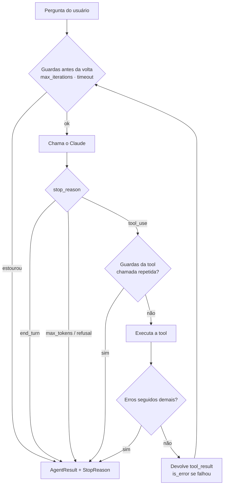

# claude-agentic-loop

Um **agentic loop** com o Claude que **sempre termina de forma segura**, com um motivo de parada explícito.

Projeto 1 da minha série de estudos para a certificação **Claude Certified Architect – Foundations (CCA-F)**,
domínio *Agentic Architecture & Orchestration*.

📘 **Quer estudar este projeto passo a passo?** Veja o [Guia de estudo](docs/GUIA-DE-ESTUDO.md).

## O problema

Num agente, quem decide quando parar é o **modelo**: ele pede uma tool, recebe o resultado, pede outra...
até achar que terminou. Sem limites, isso pode:

- repetir a mesma tool para sempre;
- estourar o orçamento de tokens;
- ficar preso tentando uma tool que sempre falha;
- travar esperando uma resposta que não vem.

Este projeto implementa **guardas de parada** que garantem que o loop sempre acaba.

## Como funciona



| Guarda | O que evita | `StopReason` |
|---|---|---|
| Máximo de voltas | loop infinito | `max_iterations` |
| Orçamento de tokens | custo descontrolado | `token_budget` |
| Timeout de relógio | agente travado | `timeout` |
| Chamada repetida (mesma tool + mesmos argumentos) | modelo "preso" | `repeated_tool_call` |
| Erros de tool seguidos | insistir numa tool quebrada | `too_many_tool_errors` |
| `stop_reason` da API | resposta cortada ou recusada | `max_tokens` / `refusal` |

## Duas implementações

| Arquivo | O que é | Como autentica |
|---|---|---|
| [`raw_loop.py`](src/agent_loop/raw_loop.py) | O loop **na mão**, com a Messages API (`stop_reason`, `tool_use`, `tool_result`). É a versão didática. | API key (`ANTHROPIC_API_KEY`) |
| [`sdk_agent.py`](src/agent_loop/sdk_agent.py) | O mesmo agente com o **Claude Agent SDK**: o loop é do SDK e as guardas viram configuração (`max_turns`, `max_budget_usd`, hook `PreToolUse`, timeout). | Login do Claude Code |

As tools ([`tools.py`](src/agent_loop/tools.py)) são definidas uma vez e usadas pelas duas versões:
`calculator` (sem `eval`, via `ast`), `get_current_time` e `lookup_ticket` (base **fictícia** de chamados).
As guardas ficam em [`termination.py`](src/agent_loop/termination.py).

## Como rodar

Requisitos: Python 3.11+ e [uv](https://docs.astral.sh/uv/).

```bash
uv sync
uv run pytest            # testa todas as guardas, sem chamar a API
```

**Modo SDK** (padrão), com o Claude Code instalado e logado (`claude auth login`):

```bash
uv run agent "Quanto é 17*23 e que horas são em São Paulo?"
uv run agent -v "Qual o status do chamado INC0002?"   # -v mostra o transcript
uv run agent --max-turns 1 "Quanto é 2+2 e que horas são?"
```

**Modo raw** (Messages API), com `ANTHROPIC_API_KEY` definida:

```bash
uv add anthropic
uv run agent --mode raw "Quanto é 17*23?"
```

> **Sobre autenticação:** para estudo local, uso o Agent SDK com o login da minha assinatura do Claude.
> Para um produto usado por outras pessoas, o correto é autenticar com **API key**: a Anthropic não permite
> oferecer o login do claude.ai em produtos de terceiros.

## Testes sem custo

[`tests/fake_client.py`](tests/fake_client.py) imita o `anthropic.Anthropic()` com respostas roteirizadas.
Assim dá para forçar cada cenário (modelo em loop, tool repetida, erros seguidos, `max_tokens`, timeout,
falha de rede) de forma determinística e sem gastar tokens.

## O que aprendi

- Um agente é só um `while`: **chama o modelo → executa as tools pedidas → devolve os resultados**, até o `stop_reason` deixar de ser `tool_use`.
- Todo `tool_use` precisa de um `tool_result` com o mesmo `tool_use_id` na mensagem seguinte.
- Erro de tool **não deve derrubar o loop**: ele volta para o modelo com `is_error: true`, e o modelo geralmente se recupera.
- `end_turn` não é o único fim: `max_tokens` (resposta cortada) e `refusal` precisam de tratamento próprio.
- Detectar repetição exige normalizar os argumentos (`json.dumps(..., sort_keys=True)`).
- No Agent SDK as mesmas ideias viram configuração: `max_turns`, `max_budget_usd` e hooks `PreToolUse` que negam a chamada (`permissionDecision: "deny"`) e encerram o agente (`continue_: False`).
- Injetar o cliente (em vez de criá-lo dentro do loop) é o que torna o agente testável.
